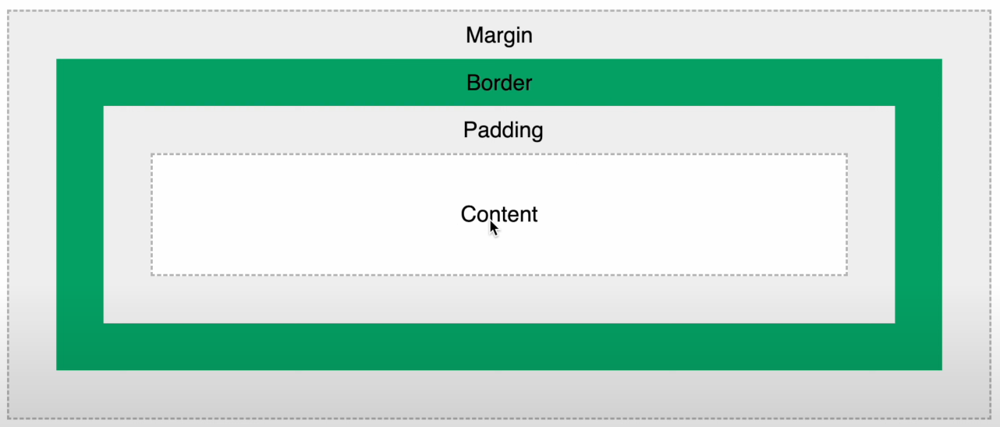

### Important Notes:
Priority of the selectors works like **ID Selector** > **Class Selector** > **Element Selector**. We should use classes to style elements rather than using id. ID is used particularly to integrate javascript code into frame. Selectors also include grouping ` #first #second {} `, nesting ` #first>article>h1 {} ` & pseudo selectors ` #first:hover {} `. *!important* used infront of any property to make it static, which means no changes are further inherited for that property respective to the element.

**Colors in styling** are mainly composed through three indexes: RGB (red, green, blue) ranging from 0 to 255. (0, 0, 0) refers to complete white and (255, 255, 255) refers to complete black. HSL (hue, saturation, light) ranging from (0 to 360, 0 to 100%, 0 to 100%) and an alpha channel (0 to 1) which refers to transparency of the color. Hexa Code #rrggbb format where each digit ranging from 0 to f. *Overflow* property controls what happens to content when it's too big to fit (visible, hidden, scroll, auto). *Clear* is used to control overflow of one side of the element.

**Units in styling** starts with *% percentage* which means that element container will take that much percent space from the parent container, bascially relative to parent. *integer vw view width* means on the screen currently using that much percentage of screen used. Percentage & em is a relative unit & View Width is an absolute unit. 1 *em* is equal to 16 px. It changes with the parent which is proportional to device width. *rem relative em* is used upon on the root element which is html.

**Box model**  mainly contain content, padding (top, bottom, left, right), border (size style color), margin (top, bottom, left, right). ` box-sizing: border-box; ` property is used combine border + padding + content in our sizing. *text-shadow property* is useful to style text, (horizontal_displacement, vertical_displacement, blur_radius, color). **Block elements** are paragraph(p), headers(h), divisions(div), forms, list(ul, ol, li). **Inline elements** are images, anchor, span. *Display* has block, inline, inline-block, none property. The parent of *absolute element* is root element.

**Flex Box** is useful to manage layout on our webpage. We have to assign ` display: flex; ` to our main container, then, all the childrens inside the containers inherit properties of flex. There are two axis: Main Axis(justify-content) & Cross-Axis(align-items). All the childrens flex around the main axis. Properties include flex-wrap, gap, row-gap, column-gap, flex-direction, order, flex-grow(IMP.), flex-basis.